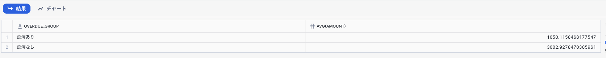
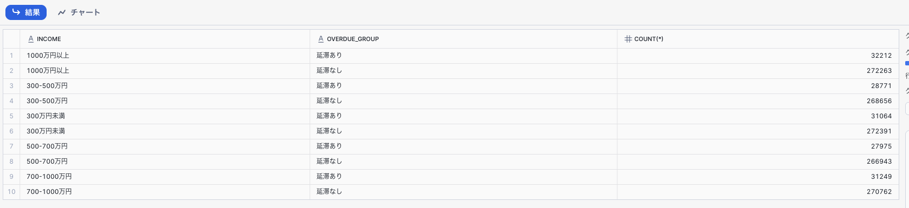

# テーブル定義と作成したデータについて

## 1.顧客テーブル（Customer）
顧客の年齢、職業、年収、住所などの属性情報を管理するテーブル。

|No.|属性|説明|備考|
|---|---|---|---|
|0|USERID|UUID、個人識別子を匿名化した情報||
|1|AGE|例：18〜24歳、25〜34歳など。世代ごとの傾向分析に使われる。||
|2|GENDER|例：男性、女性、その他。ターゲティングやUI設計に活用。||
|3|AREA|例：東京都、関西地方、海外など。地域ごとのニーズや行動パターンを分析。||
|4|JOB|例：会社員、学生、フリーランスなど。ライフスタイルや購買力の指標になる。||
|5|INCOME|例：年収300万円未満、1000万円以上など。購買傾向やサービス利用に影響。||
|6|EDUCATION|例：高卒、大卒、大学院卒など。情報理解度や関心分野の予測に使われる。||
|7|FAMILY|例：独身、既婚、子供ありなど。ライフステージに応じたニーズ分析に有効。||
|8|INTEREST|例：旅行、テクノロジー、ファッションなど。パーソナライズやレコメンドに活用。||
|9|DEVICE|例：スマホ中心、PC中心、マルチデバイスなど。UX設計や広告配信に影響。||


## 2.個人消費テーブル（Expanded_Personal_Finance_Dataset）
個人の支出のトランザクションを管理するテーブル。

|No.|属性|説明|備考|
|---|---|---|---|
|0|USERID|UUID、個人識別子を匿名化した情報||
|1|DATE|トランザクションが発生した日付||
|2|CATEGORY|"Utilities","Rent","Health & Fitness","Travel","Investment","Entertainment","Food & Drink","Shopping"||
|3|UNIT|購入した商品の単価||
|4|QUANTITY|購入した商品の数||
|5|AMOUNT|単価と数量の積||
|6|PAYMENT|"Cach", "Credit Card", "Mobile Payment", "Other"||
|7|LOCATION|都道府県、オンライン、その他||


## 3.延滞テーブル（Overdue）
クレジットカードの延滞があったかどうかを管理する。簡単のためレコードがあれば、そのユーザは延滞実績あり、としている。

|No.|属性|説明|備考|
|---|---|---|---|
|0|USERID|UUID、個人識別子を匿名化した情報|UK|

## 4.作成したデータについて（datagen.pyを実行して作成する）
年収などの個人属性に関係なく、ランダムに顧客を選んで、旅行支出の平均値を意図的に増加させ、旅行支出の平均値が多い人は、延滞実績なし、というデータとしている。<br>
10000人分の顧客テーブルを作成。特に乱数調整はしていないため、偏りはないはず。<br>
1人当たり100-200件のトランザクションデータを作成。個人属性に関係なくランダムで500人を選び、旅行支出を最大値である5000ドルに設定。<br>
延滞テーブルはランダムに1000人を選び延滞実績ありとする。その上で、上記の旅行支出が多い500人は除外している。<br>

## 5.作成したデータについて（8/28更新）
狙い通りにできたかを下記のように確認しています。
```
-- 延滞有無による平均旅行支出の違い
SELECT
  CASE WHEN T3.USERID IS NULL THEN '延滞なし'
       ELSE '延滞あり' END AS overdue_group,
       AVG(AMOUNT)
FROM
    CUSTOMER_DATA T1
INNER JOIN
    TRANSACTION_DATA T2
ON
    T1.USERID = T2.USERID
LEFT OUTER JOIN
    OVERDUE_TABLE T3
ON
    T1.USERID = T3.USERID
WHERE
    T2.CATEGORY = 'Travel'
GROUP BY
  CASE WHEN T3.USERID IS NULL THEN '延滞なし'
       ELSE '延滞あり' END;
```

延滞ありユーザの旅行支出を下げました。結果的に延滞なしユーザの旅行支出が相対的に上がっています。<br>
シナリオ上は、延滞ありを探しに行く質問をしてもらっても良いかもしれません。
```
-- 延滞有無による平均年収の違い（ノンデグレ確認）
SELECT
    T1.INCOME,
    CASE WHEN T3.USERID IS NULL THEN '延滞なし'
       ELSE '延滞あり' END AS overdue_group,
       COUNT(*)
FROM
    CUSTOMER_DATA T1
INNER JOIN
    TRANSACTION_DATA T2
ON
    T1.USERID = T2.USERID
LEFT OUTER JOIN
    OVERDUE_TABLE T3
ON
    T1.USERID = T3.USERID
-- WHERE
--    T1.CATEGORY = 'Travel'
GROUP BY
    T1.INCOME,
    CASE WHEN T3.USERID IS NULL THEN '延滞なし'
       ELSE '延滞あり' END
ORDER BY
    T1.INCOME,
    CASE WHEN T3.USERID IS NULL THEN '延滞なし'
       ELSE '延滞あり' END
```

どの年収区分で見ても、延滞ありと延滞なしの割合に大きな差がないことを確認。
